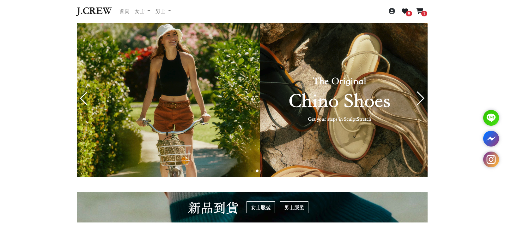
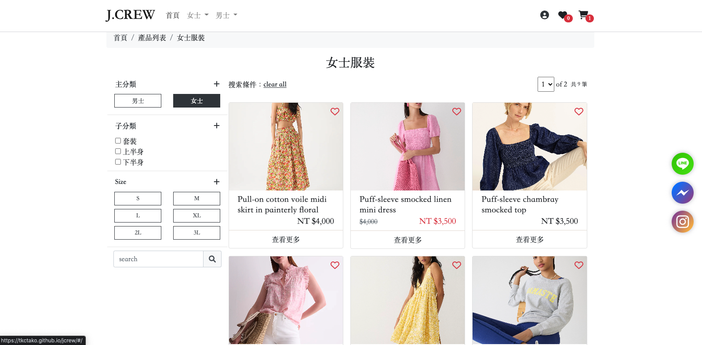
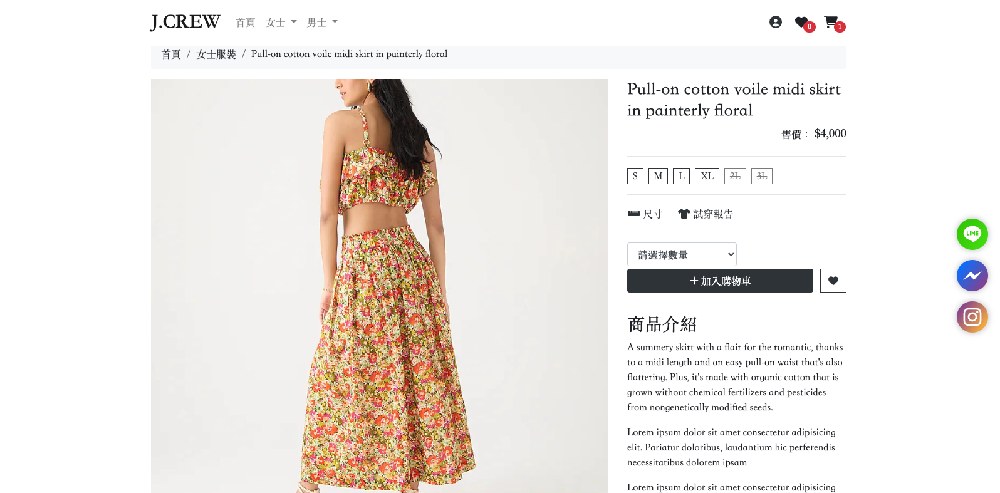
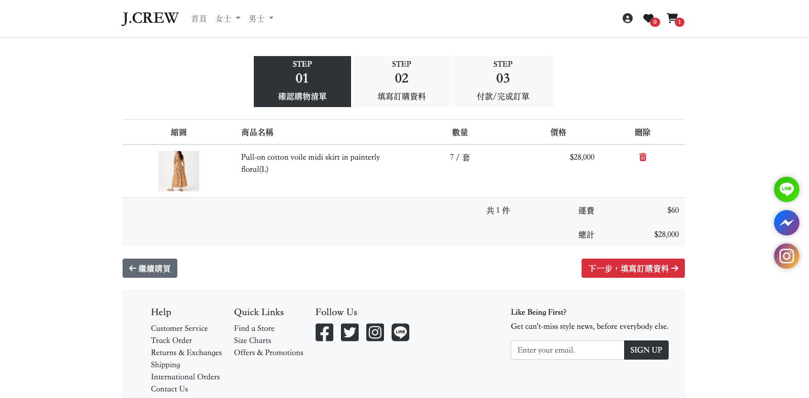
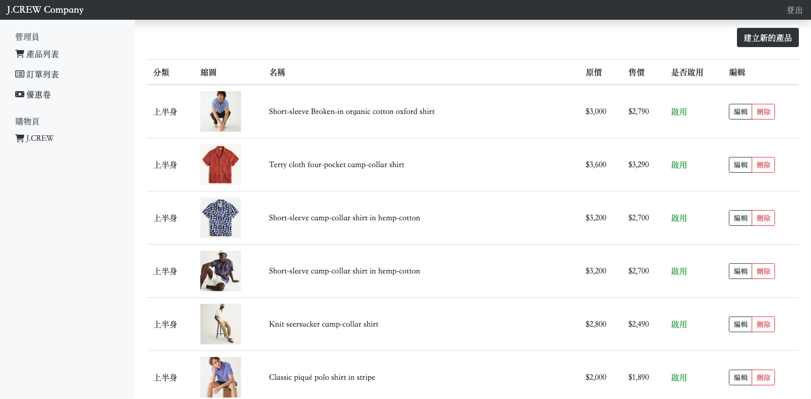

# J.CREW

<p>
  Demo : <a href="https://tkctako.github.io/jcrew/#/">
  J.CREW
  </a>
</p>

<p>
  本專案僅作為練習，無商業用途，圖片來自 <a  href="https://www.jcrew.com/tw/">J.CREW</a>
</p>

<p>
  
</p>

## 使用技術


- 利用 [Vue.js](https://vuejs.org/) 搭配 [Vue CLI](https://cli.vuejs.org/) 建立專案
- 利用 [axios](https://github.com/axios/axios) 處理 AJAX 請求，獲取後端資料
- 利用 [Bootstrap 4](https://getbootstrap.com/) 建立畫面 UI ，具備響應式設計
- 利用 [VeeValidate](https://vee-validate.logaretm.com/v2) 處理表單驗證
- 利用 [vue-awesome-swiper](https://github.com/surmon-china/vue-awesome-swiper) 製作廣告輪播系統，讓使用者能順暢的觀看各個廣告
- 利用 [vue-loading](https://github.com/ankurk91/vue-loading-overlay) 讓使用者使用網頁時不間斷
- 利用 [AOS](https://michalsnik.github.io/aos/) 製作視覺滾差，提升使用者觀看體驗

## 特色介紹

**前台**
1. 包含登入頁面、商城、產品分類頁、產品細節頁等頁面
2. 具備關聯產品、專欄空間等多元區塊
3. 擁有具互動性的購物車、收藏清單系統
4. 具有產品訂購紀錄、資料驗證、確認下單等功能

**後台**
1. 可進行產品的新增、修改、刪除等操作
2. 可管理訂單與圖片
3. 具備使用者驗證機制，以確保操作安全

> 可透過商品主類別、子類別、尺寸、關鍵字進行搜尋
<p>
  
</p>

> 呈現商品細節與關連商品
<p>
  
</p>

> 具有購物車與下單系統
<p>
  
</p>

> 具有後台管理系統
<p>
  
</p>

> 支援行動裝置的RWD設計
<p>
  
</p>


## REST APIs

後端 API 由 [六角學院](https://courses.hexschool.com/)提供


## Project setup
```
npm install
```

### Compiles and hot-reloads for development
```
npm run serve
```

### Compiles and minifies for production
```
npm run build
```

### Lints and fixes files
```
npm run lint
```

### Customize configuration
See [Configuration Reference](https://cli.vuejs.org/config/).
